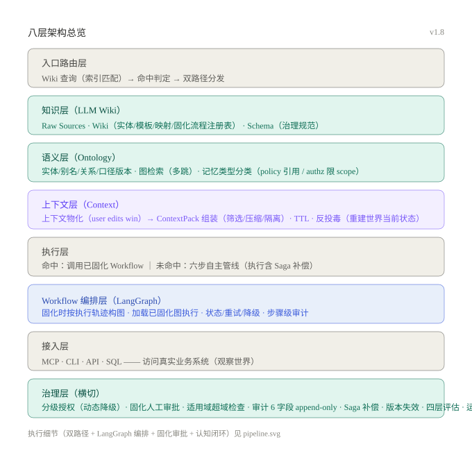
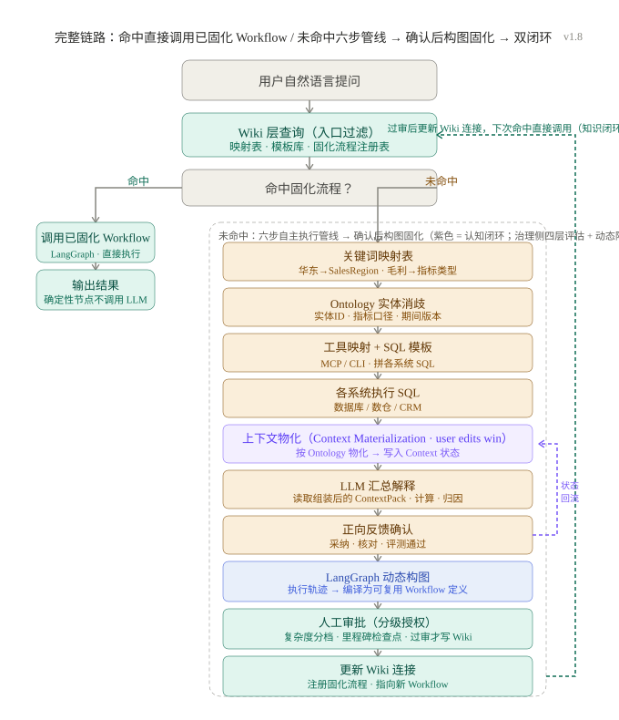

# Wiki + Ontology 企业知识行动架构

[](LICENSE)

> 让企业知识从"可检索"走向"可行动"：LLM Wiki 沉淀认识，Ontology 统一语义，Context 重建世界当前状态，LangGraph Workflow 编排执行，固化经人工审批实现知识复利 + 认知同步。

本仓库是一份**架构设计方案**（非实现代码），面向企业知识库 / AI Agent 平台的技术负责人和架构师。方案回答一个核心问题：**如何让 Agent 基于企业知识正确选择工具、绑定参数并完成跨系统查询，而不是停留在"检索到相关文档"？**

## 核心设计

1. **入口先查记忆（Wiki 层）+ Context 状态**：用户提问后先查**固化流程注册表**（映射表、SQL 模板、已审批 Workflow 的目录）决定"怎么执行"，同时读 **Context 当前状态**决定"基于什么现状执行"。命中 → 直接调用对应 LangGraph Workflow，低 token、秒级响应、结果可审计。
2. **未命中先执行、后固化**：直接执行六步管线——关键词映射 → Ontology 实体消歧 → 工具映射与参数绑定 → 跨系统执行 → **上下文物化（写入 Context）** → 汇总解释，全程受治理与审计并保留执行轨迹；确认无误后再按轨迹做 LangGraph 构图固化。
3. **执行成功后构图固化（须人工审批）**：按执行轨迹编译为可复用的 LangGraph Workflow 定义，提交**人工审批**；过审后才更新 Wiki 固化流程注册表——同类问题下次直接命中调用。**审批未过不写 Wiki。**
4. **认知闭环（Context 回流）**：执行确认后，结论、归因与新状态回流更新 Context——后续 Agent 基于"世界当前状态"决策，而非执行时刻的快照。**Ontology 定义世界，Context 重建世界。**
5. **经验沉淀（Lesson）**：借鉴 Agent Memory 会话记忆模式，任务开始加载领域教训、任务结束沉淀 positive/negative 经验，与 Wiki 知识页互补——**Wiki 存知识（编译过的结论），Lesson 存经验（发生过的事 + 学到的）**，负向知识同样参与复利。
6. **上下文按预算组装（ContextPack）**：物化结果不直接全塞 prompt——按 持久化→筛选→压缩→隔离 组装成强类型 ContextPack（含 trace_id），工具动态注入白名单内子集，对策上下文腐烂与中段丢失。
7. **评估先行、分级自主、监控兜底**：四层评估（Outcome / Trajectory / Golden Dataset / CI 回归）坏例回流黄金集；审批从"二元等批"升级为按复杂度分档的自主度 + 里程碑检查点 + 运行期监控；授权记忆限 scope 并默认过期（防授权放大）。
8. **全程可治理**：指标口径、权限、版本、来源全部纳入 Ontology 与 Wiki 管理，错误固化有护栏，过期规则有失效机制。

## 架构总览

### 分层视图



八层职责一句话：**入口路由层**决定走哪条路，**知识层（Wiki）**负责记忆与沉淀（维护固化流程注册表），**语义层（Ontology）**统一业务语言（定义世界结构），**上下文层（Context）**上下文物化并重建世界当前状态，**执行层**区分命中调用已固化 Workflow 与未命中六步管线执行，**Workflow 编排层（LangGraph）**固化时按执行轨迹构图、命中时加载已固化图执行，**接入层**访问真实系统（观察世界），**治理层**横切保障安全与质量（含固化人工审批、Context 审计）。

### 完整链路（双路径 + 双闭环）



- **左侧（命中路径）**：从 Wiki 固化流程注册表取出已审批 Workflow，加载到 LangGraph 直接调用
- **右侧（六步执行 + 固化审批）**：直接执行六步管线（含上下文物化 → ContextPack 组装）→ 确认信号/分级自主 → 按执行轨迹 LangGraph 构图 → **分级授权下人工审批** → 过审后更新 Wiki 连接；治理侧四层评估（Outcome/Trajectory/Golden/CI 回归）持续运行，坏例回流黄金集
- **绿色虚线（知识闭环）**：过审注册后下次入口命中直接调用，复用降本
- **紫色虚线（认知闭环）**：确认后状态/结论回流更新 Context，让 Agent 基于世界当前状态决策

## 仓库结构

```
wiki-ontology-agent-architecture/
├── README.md                    # 项目简介与快速导航
├── AGENTS.md                    # 面向 AI 会话的仓库操作规范（隐含工作流显式化）
├── LICENSE                      # MIT License
├── CONTRIBUTING.md              # 贡献指南
└── docs/
    ├── architecture.md          # 完整架构设计文档（核心交付物）
    ├── research/                # 技术选型/调研文档
    │   └── semantica-evaluation.md   # Semantica 可行性评估 + PoC（2026-09-04）
    ├── references/             # 外部参考资料（PDF 等）
    └── images/
        ├── architecture-overview.svg   # 八层架构总览图
        └── pipeline.svg                # 完整链路架构图
```

## 快速阅读指南

- 想了解整体方案：读 [docs/architecture.md](docs/architecture.md)
- 想理解双路径与双闭环：看完整链路图 + architecture.md 第 4 章
- 想了解 Workflow 编排层：看 architecture.md 第 3.1 节与 6.7 节
- 想了解上下文层（Context / 上下文物化 / 认知闭环）：看 architecture.md 第 3.2 节与 6.8 节
- 想评估 token 成本：看 architecture.md 第 7 章
- 想了解经验沉淀（Lesson / 会话记忆协议）：看 architecture.md 第 6.6 节与 8.1 节
- 想落地实施：看 architecture.md 第 11 章落地路线图
- 想参与贡献：读 [CONTRIBUTING.md](CONTRIBUTING.md)

## 参考实现（可运行）

本仓库是**设计文档**，配套的**可运行参考实现**为 **LangGraph + ontology-enterprise** 组合：

- **[LangGraph](https://github.com/langchain-ai/langgraph)** 承担 **Workflow 编排层**（图编排、状态持久化、重试、断点续跑）；
- **[ontology-enterprise](https://github.com/qq450770953/ontology-enterprise)**（Python CLI + SQLite）承担**语义层与治理底座**：

| 本设计（架构层） | 参考实现 |
|---|---|
| 语义层：Ontology 实体/关系/约束 | `type define` / `object` / `link`（基数、环检测） |
| 上下文层：状态/事件/物化 | `state` 状态机 + `method` 物化校验 + `lineage` 来源追溯 |
| 治理层：指标口径版本/约束校验 | `state` 状态机 + `method` 确定性计算 + `type` schema 校验 |
| Workflow 编排层：图/状态/重试/审计 | LangGraph 构图 + `state`/`method`/`action`/`audit` |
| 执行层：受治理动作 | `action`（前置条件/角色/幂等/副作用/审计） |
| 治理层：权限/审计/血缘 | `policy`（RBAC）+ `audit` + `lineage` |
| 双路径中"命中优先" | 固化流程注册表指向已审批图，直接加载调用 |

想动手体验语义底座：clone ontology-enterprise 后 `python3 scripts/ontology_enterprise.py --root ./ontology init` 即可起一个带 RBAC 与审计的本地图谱。

## 设计来源

本方案综合以下思想：Andrej Karpathy 的 LLM Wiki（知识编译与复利）、凯哥探数《AI时代的本体论》（Ontology 定义世界、Context 重建世界）、W3C OWL（本体语义）、Lewis 等人的 RAG（证据检索）、Yao 等人的 ReAct（推理-行动循环）、LangGraph（有状态图编排）、Model Context Protocol（工具接入），并将其组织为一条"记忆（Wiki 固化流程注册表）→ 语义（Ontology）→ 状态（Context）→ 编排（LangGraph Workflow）→ 审批 → 复利（知识闭环 + 认知闭环）"的完整链路。

## License

[MIT](LICENSE) —— 详见 [CONTRIBUTING.md](CONTRIBUTING.md) 中的贡献者许可说明。
